# 学会使用这15个现代化CRM工具，五分钟搞定客户管理

小型企业和创业团队在客户关系管理上常遭遇三大痛点：传统CRM系统过于臃肿复杂、数据分散在邮箱与电子表格难以整合、团队协作效率低下导致商机流失。一款优秀的现代化CRM工具能将客户信息整合时间从数小时压缩至几分钟，通过智能自动化减少80%的重复数据录入，实时同步团队动态确保每个商机都能及时跟进。本文汇总了15个经市场验证的轻量级CRM平台，涵盖AI驱动联系人管理、社交媒体集成、无代码定制、多渠道沟通追踪等核心功能，帮助团队彻底摆脱Excel管理客户的混乱状态，让销售流程更流畅高效。

***

## **[folk](https://www.folk.app)**

专为现代团队打造的轻量级CRM，像Notion一样灵活易用。

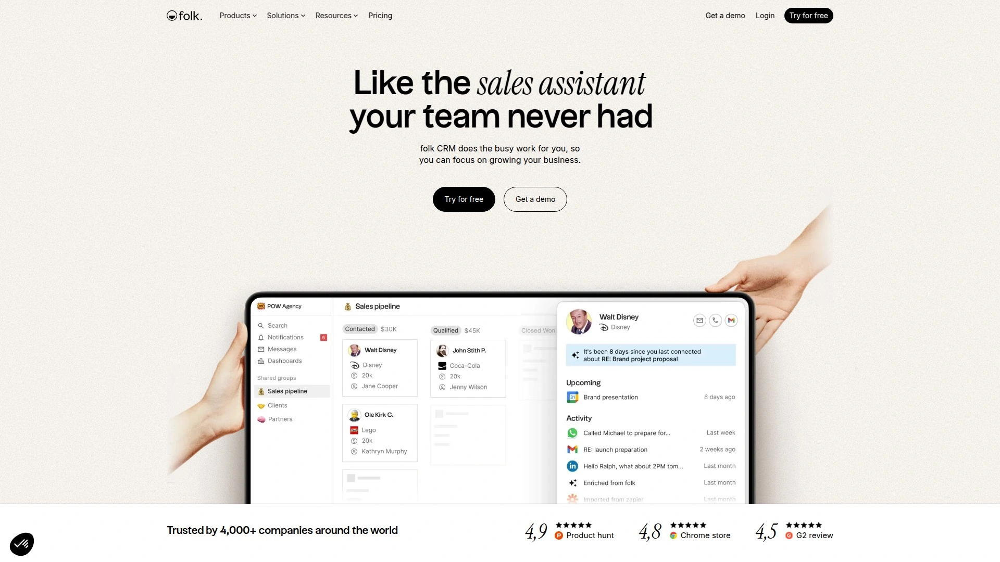

folk采用极简设计理念，将复杂的CRM操作简化为直观的可视化界面。核心优势在于无需培训即可上手——团队成员可在5分钟内开始使用，通过拖拽方式自定义字段、视图和工作流程。平台提供强大的联系人管理能力，自动从LinkedIn、邮件和其他来源丰富联系人资料，消除手工录入负担。

系统内置智能标签和分组功能，支持按行业、地理位置、互动状态等任意维度组织联系人。Chrome扩展程序允许在浏览任何网页时一键保存联系人信息。协作功能特别出色——团队成员可实时查看彼此的笔记、任务和沟通历史，避免重复联系客户。集成Gmail、Outlook、Slack等常用工具，确保所有沟通记录自动归档到相应联系人档案。

folk特别适合创业公司、咨询团队、投资机构和创意机构等需要灵活管理复杂关系网络的组织。定价透明（Standard计划20美元/用户/年），提供慷慨的免费试用期。产品在Product Hunt获4.9分、Chrome商店4.8分、G2评分4.5分，深受用户喜爱。

***

## **[Pipedrive](https://www.pipedrive.com)**

销售驱动型CRM，专注将潜在客户转化为成交订单。

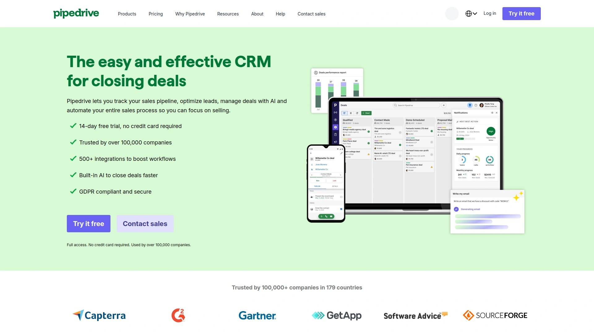

Pipedrive以可视化销售管道著称，将复杂销售流程转化为清晰的阶段卡片。每笔交易在管道中移动时自动触发提醒和任务，确保销售代表永不错过关键跟进时机。活动与目标追踪功能帮助管理者实时监控团队绩效，识别瓶颈环节并及时调整策略。

AI销售助手分析历史数据，预测交易成功概率并推荐最佳行动方案。邮件集成支持直接在CRM内发送和追踪邮件，打开率和点击率一目了然。移动应用功能完整，销售人员外出时可随时更新交易状态、添加笔记或安排会议。报表系统提供收入预测、转化率分析和团队排名，数据驱动决策。Essential计划14美元/用户/月起，14天免费试用。适合10-200人规模、以交易为中心的B2B销售团队。

***

## **[HubSpot CRM](https://www.hubspot.com)**

全球领先的免费CRM平台，集成营销销售服务全流程。

HubSpot提供业内最慷慨的免费计划，支持无限用户和联系人，包含完整的联系人管理、交易追踪、任务管理、邮件追踪和会议安排功能。平台核心优势在于统一的客户视图——营销活动、销售互动、客服工单全部汇聚在单一时间线上，团队成员随时掌握客户完整旅程。

付费版本增加营销自动化、销售自动化、客服工单系统和CMS功能，构建从吸引访客到培育客户的闭环生态。邮件营销工具支持拖拽式编辑器、A/B测试和细分受众。聊天机器人和实时聊天功能将网站访客即时转化为销售线索。HubSpot App Marketplace拥有1000+集成应用。免费计划永久可用，付费版从45美元/月起。特别适合需要营销销售一体化、追求长期可扩展性的成长型企业。

***

## **[Zoho CRM](https://www.zoho.com/crm)**

高性价比企业级CRM，AI功能与深度定制能力兼备。

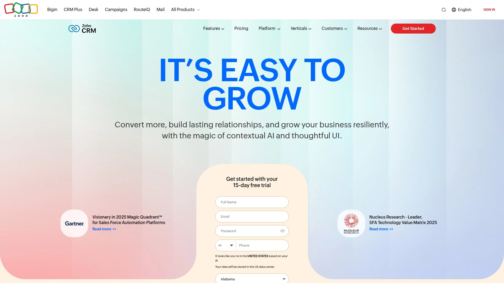

Zoho CRM提供从个人到大型企业的全覆盖方案，免费版支持3用户，标准版14美元/用户/月起。Zia AI助手通过机器学习预测最佳联系时间、识别异常交易、自动化数据录入并生成智能推荐。多渠道沟通管理整合电话、邮件、社交媒体、实时聊天和网络表单，客户无论从哪个渠道联系都能获得一致体验。

Canvas设计工作室允许无代码定制CRM界面，按团队角色和业务流程重新组织布局。工作流自动化引擎支持复杂的条件逻辑，自动执行分配线索、更新字段、发送通知等操作。蓝图功能为销售流程设定标准化步骤和检查点，确保新员工遵循最佳实践。Zoho生态系统包含45+业务应用，从项目管理到财务会计无缝集成。提供本地化部署选项，适合数据安全要求严格的企业。

---

## **[Monday Sales CRM](https://monday.com)**

可视化工作操作系统，将CRM与项目管理完美融合。

Monday以彩色看板和灵活工作流闻名，将传统CRM转化为高度可视化的协作平台。无代码构建器允许团队按独特需求定制销售流程，从潜在客户挖掘到售后服务全生命周期管理。自动化配方库提供数百个预设规则，如"当交易状态变为已赢得时，自动通知交付团队并创建入职项目"。

集成超过200个应用包括Gmail、Outlook、Slack、Zoom、Mailchimp等。时间线视图清晰展示交易进度和截止日期，甘特图模式适合管理复杂销售项目。表单功能将网站访客自动转化为CRM线索，分配规则确保快速响应。仪表盘小部件可自由组合，实时显示销售漏斗、收入预测、团队工作量等关键指标。Basic计划10美元/座位/月，提供14天免费试用。适合需要跨部门协作、销售流程复杂多变的创新型团队。

***

## **[Salesforce Sales Cloud](https://www.salesforce.com)**

全球市占率第一的企业级CRM，功能最强大可扩展性最高。

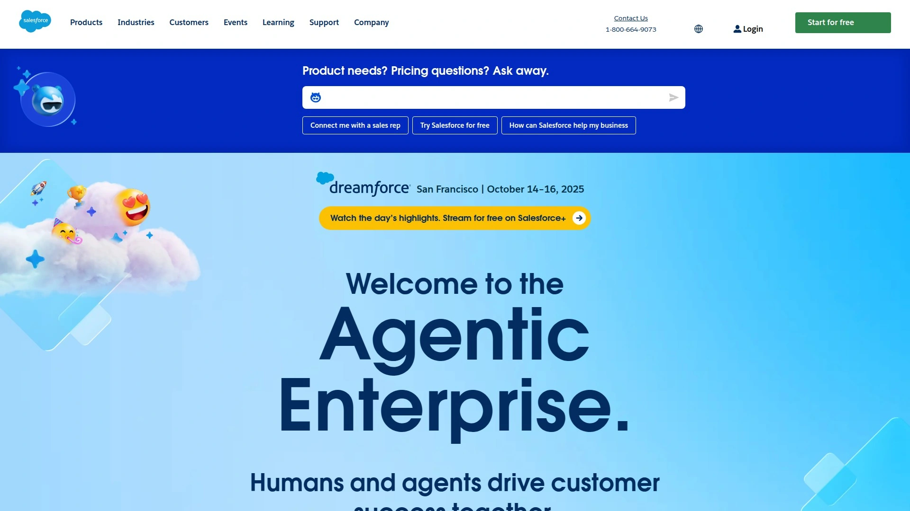

Salesforce作为CRM行业标杆，提供从小型企业到跨国集团的完整解决方案。Einstein AI层深度嵌入平台，提供预测性线索评分、机会洞察、自动化数据录入和对话智能分析。360度客户视图整合销售、服务、营销、商务数据，确保每个部门都能访问统一客户档案。

AppExchange应用市场拥有7000+第三方应用和组件，满足各行业特殊需求。Lightning平台支持无代码/低代码定制，快速构建定制应用和自动化流程。Slack集成将团队协作与CRM数据连接，在日常沟通中嵌入客户洞察。移动应用功能完整，离线模式确保现场销售人员持续工作。定价从25美元/用户/月起，企业版和无限版提供更高级功能。实施复杂度较高，建议配备专业管理员或咨询伙伴。适合500人以上、需要深度定制和长期投资的大型企业。

***

## **[Copper CRM](https://www.copper.com)**

Google Workspace原生CRM，Gmail用户的最佳选择。

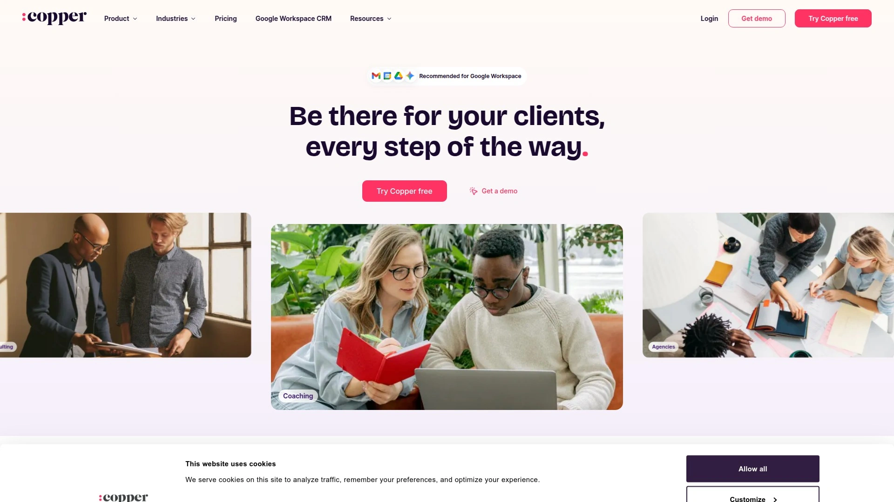

Copper深度集成Google Workspace生态，直接嵌入Gmail、Google Calendar、Google Drive界面。用户无需切换应用即可在收件箱中查看联系人历史、创建交易、设置提醒。系统自动从邮件往来中提取联系人和公司信息，智能填充CRM记录消除90%手工录入。

Chrome扩展允许在浏览LinkedIn或任何网页时一键保存联系人到Copper。管道管理采用拖拽式卡片视图，交易进展一目了然。任务和项目管理功能支持按客户或交易组织待办事项，确保关键行动不被遗漏。报表包括销售预测、团队绩效、活动追踪和自定义仪表盘。定价从25美元/用户/月起，Basic计划适合3-10人小团队。获得Google官方"Recommended for Google Workspace"认证，特别适合深度依赖Gmail和Google日历的团队。

---

## **[Close CRM](https://www.close.com)**

专为初创企业和SMB设计的销售沟通平台。

Close将CRM与内置拨号器、邮件自动化和短信功能结合，销售代表无需离开平台即可完成所有客户沟通。Power Dialer一键批量外呼，自动跳过语音信箱和忙音，拨号效率提升300%。所有通话自动录音并转录文本，管理者可回顾关键对话并指导团队。

邮件序列功能支持创建多步骤跟进流程，根据收件人行为自动调整发送节奏。短信集成允许向美国和加拿大客户发送文本消息，提高响应率。智能视图和过滤器快速定位需要跟进的线索，确保高价值机会优先处理。报表系统追踪拨号次数、邮件打开率、会议预约率等活动指标。Startup计划49美元/用户/月，包含完整拨号和邮件功能。特别适合依赖电话销售、追求高效外呼的B2B团队。

---

## **[Attio](https://attio.com)**

下一代数据驱动CRM，强大灵活且高度可定制。

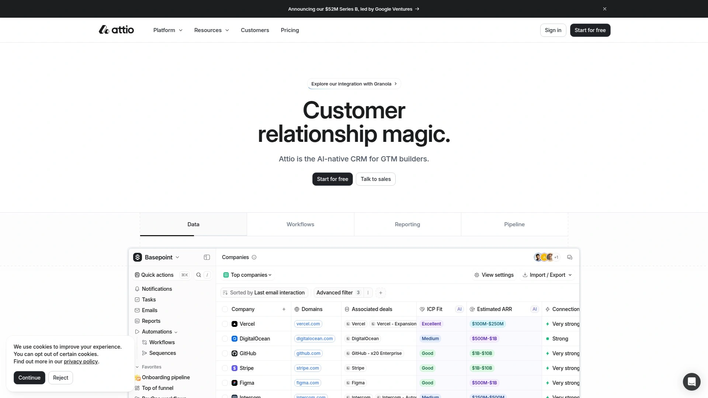

Attio采用现代数据库架构，将CRM转化为可随意塑形的数据工作空间。用户可创建自定义对象（如投资组合公司、合作伙伴、活动）并定义对象间关系，突破传统CRM的联系人-交易二元结构。实时协作功能允许团队成员同时编辑记录，变更即时同步类似Google Docs。

数据丰富引擎自动从公开来源补全公司和联系人信息，包括融资轮次、员工规模、技术栈等。工作流自动化基于任意数据变化触发，如"当联系人公司获得B轮融资时，自动提醒销售经理并提升线索优先级"。Gmail和Outlook插件在收件箱中嵌入CRM上下文，邮件自动关联到相关记录。API和Zapier集成支持与数千个应用连接。定价从29美元/座位/月起。特别适合风投机构、咨询公司、科技初创等需要管理复杂关系网络和非标准流程的组织。

---

## **[Nimble CRM](https://www.nimble.com)**

社交销售专家，自动从社交媒体丰富客户档案。

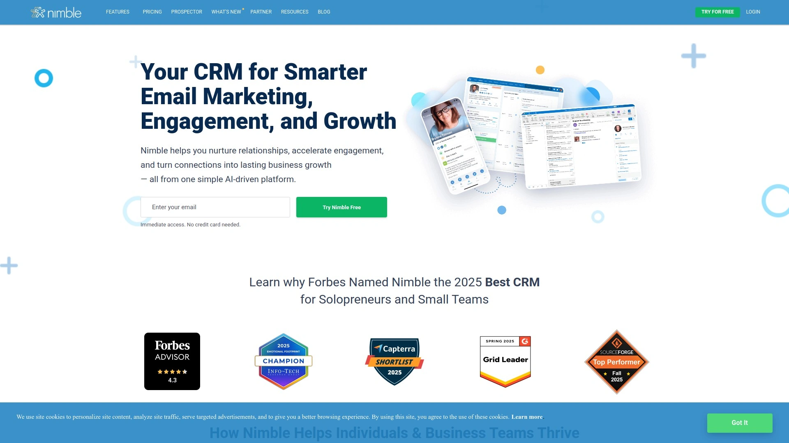

Nimble独特优势在于社交媒体集成深度——平台自动从LinkedIn、Twitter、Facebook提取联系人信息并持续更新。Prospector浏览器扩展在访问任何网站或社交资料时显示联系人卡片，一键保存到CRM并自动填充职位、公司、社交账号等字段。Today页面整合任务、约会和社交互动提醒，确保重要事项不被遗漏。

联系人分组和标签系统支持创建动态细分，自动将符合条件的联系人加入特定列表。群发邮件功能支持模板和合并字段，追踪打开率和点击率。团队协作功能允许共享联系人、分配任务和添加内部备注。销售管道视图按阶段组织交易，拖拽即可推进。Nimble与Microsoft 365和Google Workspace深度集成，支持双向日历同步。定价24.90美元/用户/月，提供14天免费试用。特别适合社交销售团队、需要外部关系拓展的顾问和代理商。

***

## **[Agile CRM](https://www.agilecrm.com)**

一体化销售营销服务平台，免费计划功能丰富。

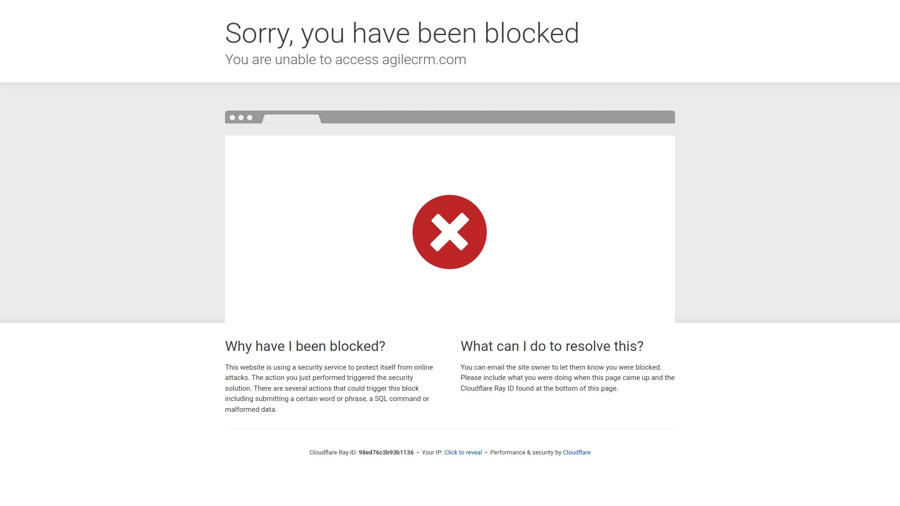

Agile CRM提供业内功能最全面的免费计划，支持10用户、联系人管理、交易追踪、基础营销自动化和客服工单，创业团队零成本即可启动。付费版本从8.99美元/用户/月起，增加高级自动化、网络参与追踪、双向邮件同步和电话集成。

营销自动化包含登陆页构建器、邮件营销、社交媒体发布和网站访客追踪。行为追踪记录潜在客户在网站上的每个动作，根据参与度自动评分并触发跟进流程。Telephony集成支持一键拨号、通话录音和短信发送。客服工单系统将支持请求分配给团队成员并追踪解决时间。移动应用提供完整CRM功能，外出时可访问联系人、更新交易、添加笔记。特别适合预算有限、需要销售营销服务三合一解决方案的小微企业。

***

## **[OnePageCRM](https://www.onepagecrm.com)**

行动导向型CRM，将复杂销售流程简化为下一步行动。

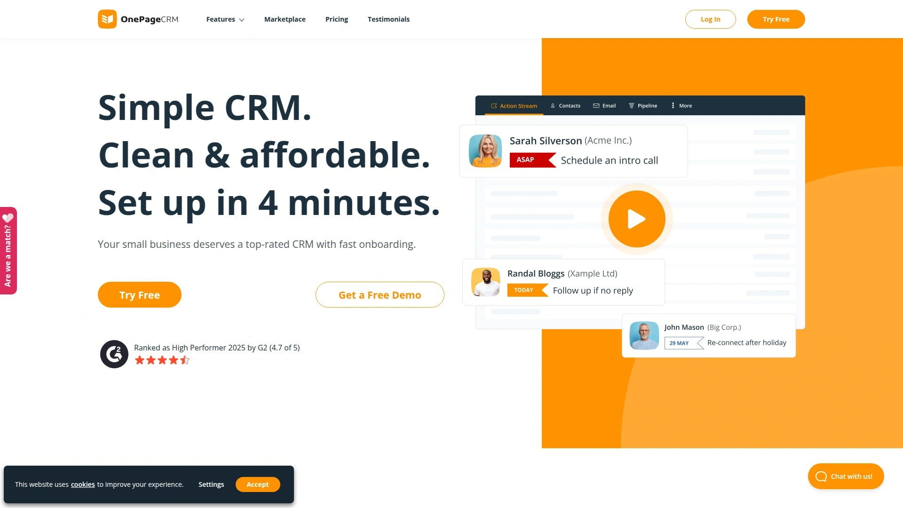

OnePageCRM采用GTD（Getting Things Done）方法论，围绕"下一步行动"组织工作。每个联系人和交易都必须定义下一步行动和截止日期，系统按优先级排序展示待办事项。这种设计强制销售代表专注推进而非仅仅记录信息，显著提升执行效率。

Action Stream时间线记录每次互动——通话、邮件、会议、笔记按时间顺序展示，快速了解客户关系历史。标签和过滤器支持按行业、地区、状态细分联系人。邮件集成支持在CRM内发送和追踪邮件，模板库加速常用沟通。销售目标追踪功能设定月度或季度目标，实时显示完成进度。浏览器扩展和移动应用确保随时随地访问CRM。定价从12美元/用户/月起，提供21天免费试用。特别适合独立销售代表、小型团队和追求简洁高效的行动派。

***

## **[Insightly](https://www.insightly.com)**

项目驱动型CRM，销售交付一体化管理。

Insightly独特之处在于内置项目管理功能，交易赢得后自动转化为交付项目。项目模块支持任务分配、里程碑追踪、文档共享和时间记录，确保客户从售前到售后的无缝体验。这种设计特别适合需要长周期交付的服务型企业，如咨询公司、代理商、系统集成商。

关系链接功能映射组织架构和人际关系网络，可视化展示决策者、影响者和使用者之间的连接。自定义字段和对象支持按业务需求扩展数据模型。工作流自动化基于任意触发条件执行操作，从简单通知到复杂多步流程。营销附加模块提供邮件营销、登陆页和表单功能。集成Google Workspace、Microsoft 365、Slack、Mailchimp等主流工具。定价从29美元/用户/月起。特别适合B2B服务公司、需要销售与交付协同的组织。

---

## **[Keap](https://keap.com)**

小型企业自动化CRM，邮件营销与销售流程深度整合。

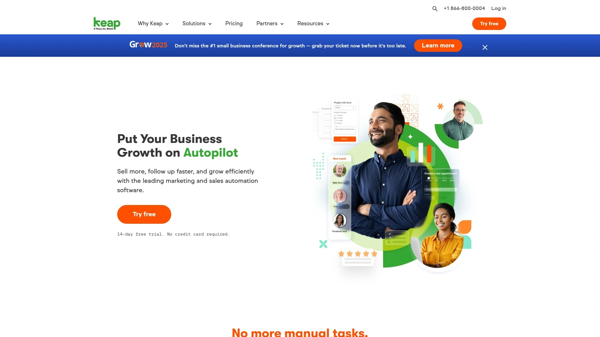

Keap（前身Infusionsoft）专注小型企业营销销售自动化，将CRM、邮件营销、电商和支付整合在统一平台。自动化构建器采用可视化画布，拖拽设计复杂的多触点培育流程——根据潜在客户行为（如打开邮件、点击链接、访问页面）自动调整后续沟通策略。

登陆页和表单构建器快速创建线索捕获工具，新线索自动进入CRM并触发欢迎序列。约会安排功能允许客户在线预订咨询或服务，自动同步到日历并发送提醒。电商功能支持创建产品目录、处理支付和自动开具发票。文本消息营销模块通过短信与客户沟通，提升触达率。报表追踪销售漏斗、营销活动ROI和收入来源。定价从249美元/月起（包含2用户），适合教练、顾问、服务提供者等依赖持续客户培育的独立专业人士和微型企业。

***

## **[Breakcold](https://www.breakcold.com)**

AI原生社交销售CRM，LinkedIn集成能力最强。

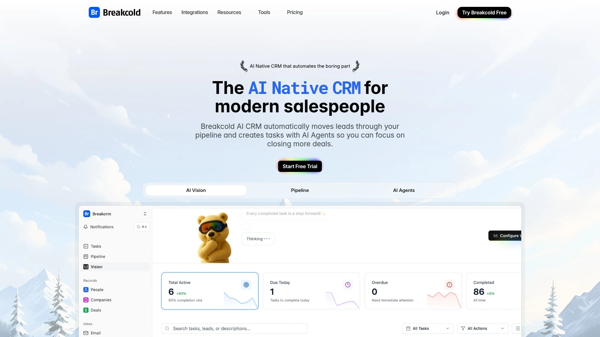

Breakcold专为现代社交销售设计，深度集成LinkedIn和Twitter自动化工作流。平台追踪潜在客户在社交媒体上的活动（发帖、评论、职位变动），并在CRM时间线中显示，销售代表可基于实时动态进行个性化互动。AI引擎分析互动数据，自动识别高意向线索并推荐最佳接触时机。

Chrome扩展允许在浏览LinkedIn资料时一键添加联系人到CRM，自动提取职位、公司、教育背景等信息。多渠道外展功能统一管理邮件、LinkedIn消息和Twitter DM，确保不遗漏任何沟通渠道。序列自动化支持创建跨渠道培育流程，如"第1天发LinkedIn连接请求，第3天发邮件，第7天评论其帖子"。定价从29美元/用户/月起。特别适合SDR团队、社交销售专家和依赖LinkedIn开发客户的B2B公司。

***

## 常见问题

**小型团队应该选择免费CRM还是付费轻量级工具？**

取决于业务复杂度和增长预期。HubSpot和Zoho的免费计划功能完善，适合5人以下初创团队验证产品市场匹配阶段使用。但免费版通常限制自动化规则数量、存储空间和高级报表，团队扩展到10人以上时会遇到瓶颈。folk、Pipedrive等轻量级付费工具月费100-300美元即可获得完整功能、无限自动化和优先支持，长期看性价比更高。建议先用免费版快速启动，积累3-6个月数据后评估是否需要升级或迁移到付费平台。

**如何判断CRM与现有工具栈的集成能力？**

重点考察三个维度：首先检查是否提供双向API和Webhook，确保数据能实时同步而非单向导入；其次查看原生集成列表是否覆盖团队核心工具（如Gmail、Slack、Zoom、Stripe），原生集成通常比第三方连接器更稳定；最后测试数据映射灵活性，确认自定义字段能正确同步。建议在购买前申请试用账号，实际连接现有工具并运行端到端测试场景，验证关键工作流是否顺畅。多数现代CRM提供Zapier/Make集成作为兜底方案，但自动化配额可能成为隐性成本。

**传统行业是否适合使用这些现代化CRM工具？**

完全适合，关键在于选对定位。制造业、批发分销等传统B2B企业往往涉及长销售周期、多决策者、复杂报价流程，Zoho CRM、Insightly等支持深度定制和项目管理的平台更合适。零售、餐饮等面向终端消费者的行业，可选择集成POS系统和预约功能的Keap或Monday。传统行业团队技术接受度较低，建议优先考虑界面直观、培训资源丰富的平台，如folk、Copper等主打易用性的工具。避免盲目追求功能全面导致实施失败，从核心销售流程数字化开始逐步扩展。

***

## 总结

为团队选择合适的CRM工具需要综合评估业务模式、团队规模、技术能力和预算约束。本文推荐的15个现代化平台各具特色优势，从功能全面的企业级方案到轻量灵活的协作工具均有覆盖。对于追求快速上手、灵活定制并注重团队协作体验的创新型团队，**[folk](https://www.folk.app)** 凭借其Notion式的直观界面、5分钟即可掌握的零学习曲线、强大的Chrome扩展自动填充能力以及年费仅20美元/用户的极致性价比，能够以最小摩擦帮助团队从混乱的Excel和邮箱管理过渡到结构化的客户关系系统。其灵活的标签和分组机制特别适合管理复杂关系网络的咨询公司、投资机构和创意团队。建议在最终决策前申请多平台免费试用，让实际使用团队成员对比操作体验和日常工作流适配度，选择能长期陪伴业务增长的最佳伙伴。
